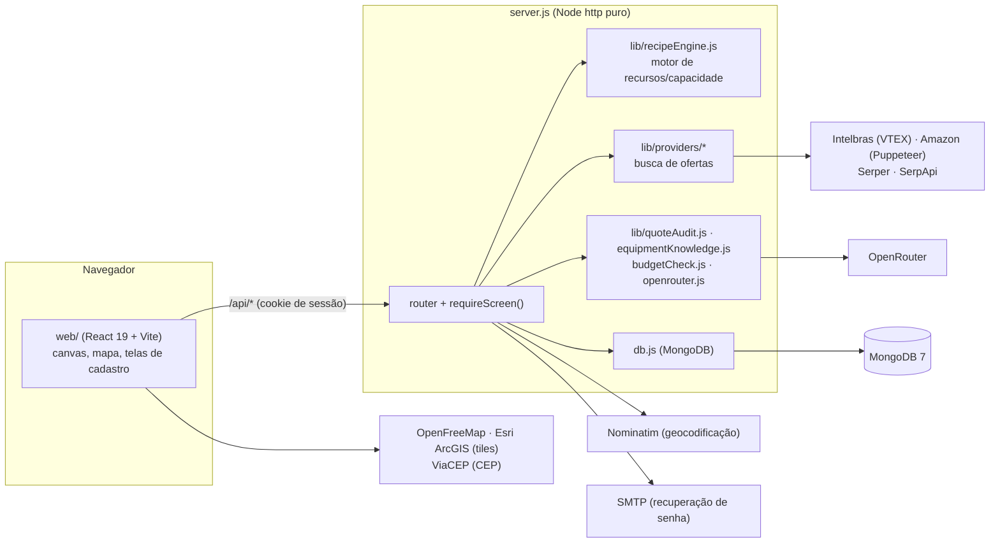
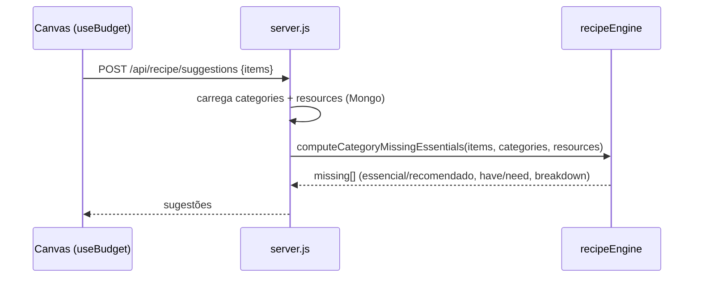

# Arquitetura do SPECIUM

Este documento descreve como o sistema está montado hoje. O **porquê** de cada decisão está em
[`SPEC.md`](../SPEC.md), em ordem cronológica.

## Visão geral

É um processo Node só. Ele serve a API e o build do front (`web/dist/`), as plantas baixas enviadas
(`uploads/floorplans/`) e conversa com o MongoDB. Não há fila nem worker: toda chamada externa acontece dentro
da requisição.

## Backend

### `server.js`: composição e roteamento

O `server.js` só faz o boot do ambiente, o roteamento HTTP (`if (method && pathname)`, sem framework) e o start
do processo. Toda regra de negócio fica em `lib/`. Cada rota protegida chama
`requireScreen(request, response, ...telas)`, que já devolve 401 (sem sessão) ou 403 (tela não liberada).

| Grupo | Rotas | Tela exigida |
|---|---|---|
| Saúde | `GET /health` | pública |
| Autenticação | `POST /api/auth/{register,login,forgot,reset,logout}`, `GET /api/auth/me` | pública / sessão |
| Usuários | `GET/POST /api/users`, `PATCH /api/users/:id` | admin |
| Configurações | `GET/PUT /api/ai-instructions`, `GET/PUT /api/smtp-settings`, `POST /api/smtp-settings/test` | admin |
| Busca | `POST /api/search`, `POST /api/compare` | `search` |
| Motor de regras | `POST /api/recipe/suggestions` (sem rede), `POST /api/recipe/prices` (sob demanda) | `budget` |
| Orçamentos | `GET/POST /api/budgets`, `GET/PATCH/DELETE /api/budgets/:id`, `POST .../address`, `POST .../floorplan` | `budget` |
| Mapa | `GET /api/map/config` | `budget` |
| Catálogo | `/api/products` (+ `template`, `import` CSV), `/api/categories`, `/api/groups`, `/api/resources` | `products` / `categories` |
| IA | `POST /api/pdf-audit`, `POST /api/assistant`, `/api/assistant/chats[/:id]`, `POST /api/assistant/budget` | `quote-audit` / `assistant` |
| Estático | `GET /uploads/floorplans/:arquivo`, `GET /*` → `web/dist/` | — |

### Módulos de `lib/`

| Módulo | Responsabilidade |
|---|---|
| `recipeEngine.js` | **Motor de recursos e capacidade**, o único motor de sugestões. Cada categoria declara `provides[]` (recursos e quantidades) e `requirements[]` (presença de categoria, capacidade de recurso ou `anyOf`). A demanda é somada **globalmente** por recurso, num ledger único entre todas as âncoras do orçamento, e devolve `missing` com `breakdown` por equipamento. |
| `specs.js` | Detecção de categoria por palavra-chave e extratores de atributos (canais, portas, PoE, tipo de cabo, modelo Mikrotik...). É usado no casamento de "oferta exata" e na ficha técnica de reserva. |
| `providers/` | `intelbras.js` (API pública VTEX, com ficha técnica oficial), `amazon.js` (Chrome headless), `serper.js` e `serpapi.js` (Google Shopping), `shared.js` (outliers de preço, lojas distintas), `index.js` (busca combinada e `fetchRecipeItemPrice`), `geocoding.js` (Nominatim, 1 req/s com User-Agent próprio) e `shoppingFetcher.js` (um `fetch` injetável para os testes). |
| `quoteAudit.js` | Pipeline do PDF: extrai o texto (`pdf-parse`), limpa cabeçalho e seções, a IA **classifica** os itens nas categorias (em lotes de 20 linhas, com nova tentativa de parse) e depois a IA **audita** por cima do resultado do motor. Usa modelos sem raciocínio, por custo e tempo. |
| `classificationMemory.js` | Cache de classificação por código de produto. Uma resposta da IA só vale depois de `MIN_VOTES` votos iguais. Um produto cadastrado sempre vence. |
| `equipmentKnowledge.js` | Fichas técnicas destiladas dos fornecedores (ONE Portaria, SIAM). Só entram no prompt quando um item do orçamento casa com elas. Também contém o assistente e a extração de linhas de orçamento. |
| `budgetCheck.js` | Confere o orçamento escrito pelo Assistente **pelo motor de regras**, não por uma segunda IA. Se acha problema, a resposta sai com os avisos no fim. |
| `budgetLinks.js` | Um orçamento vindo do Assistente já nasce com as ligações e o layout. As ligações saem do mesmo motor (`provides`/`requirements`), não de regra fixa. |
| `openrouter.js` | Cliente do OpenRouter com uma lista de modelos de reserva (o 429 da fila gratuita é comum). |
| `catalogSync.js` | Parte pura do export/import do catálogo (snapshot e plano de importação, que nunca apaga). O acesso ao banco fica em `scripts/catalog-sync.js`. |
| `auth.js` | Senha com `scrypt` (`salt:hash`), token de sessão, cookie, telas (`SCREENS`) e `canAccessScreen`. |
| `passwordReset.js` / `mailer.js` | Token de redefinição (com hash e TTL), intervalo mínimo entre e-mails e transporte SMTP injetável, que lê a configuração salva a cada envio. |
| `secretBox.js` | AES-256-GCM com a chave derivada de `SETTINGS_SECRET`. Cifra a senha do SMTP no Mongo. |
| `validators.js` | Validação de todo corpo de requisição (400 em entrada inválida). Também define os formatos de cobertura do mapa. |
| `productImport.js` / `csv.js` | Planilha de produtos (CSV com `;` e BOM, compatível com o Excel pt-BR), com o código da categoria gerado na hora. |
| `floorPlan.js` | Upload da planta baixa: extensões permitidas, tamanho máximo e nome do arquivo. |
| `http.js` | `sendJson`, `readJson`/`readBinary` com limite, `serveStatic`, `serveFromDirectory` (contra path traversal) e cookies. |
| `env.js`, `text.js`, `money.js` | Ambiente (`.env`), normalização de texto e dinheiro. |

### Modelo de dados (MongoDB)

A conexão é *lazy* (`db.js`). A URI e o banco vêm de `MONGODB_URI`/`MONGODB_DB`. No boot, o catálogo é semeado a
partir de `web/src/data/catalog.json` e `categoryResourceSeed.js` quando o banco está vazio, e a conta admin
de `DEV_EMAIL` é recriada (upsert).

| Coleção | Conteúdo |
|---|---|
| `users` | Usuários: e-mail, hash da senha, `role` (`admin`/usuário) e `screens` liberadas. |
| `sessions` | Tokens de sessão (TTL de 30 dias). |
| `password_resets` | Tokens de redefinição (com hash) e validade. |
| `budgets` | Orçamentos por usuário: itens, ligações do canvas, endereço geocodificado e planta baixa. |
| `categories` / `resources` / `groups` | O catálogo do motor: `provides`, `requirements`, recursos e agrupamentos. |
| `products` | Marca e modelo por categoria (cadastro manual ou CSV). |
| `classification_votes` | Memória de classificação da IA (votos por código de produto). |
| `settings` | Instruções da IA (classificação, auditoria, assistente) e SMTP (senha cifrada). |
| `assistant_chats` / `assistant_logs` | Conversas salvas (até 10 por usuário) e o log de perguntas e respostas, para análise. |

## Frontend (`web/`)

- `src/App.jsx`: decide entre login e app e qual aba está ativa, filtrando pelas telas permitidas
  (`lib/screens.js`, o espelho de `SCREENS` em `lib/auth.js`).
- `components/`, um diretório por tela: `budget/` (canvas React Flow, nós, sugestões, seletor de produto,
  endereço), `map/` (mapa e cobertura das câmeras), `floorplan/`, `search/`, `products/`, `categories/` (editor de
  requisitos e recursos), `audit/` (PDF), `assistant/` (chat), `users/`, `settings/`, `auth/` e `layout/`.
  Os componentes base do shadcn ficam em `ui/`.
- `hooks/`: `useBudget` (estado do orçamento e chamadas ao motor), `useAuth`, `useCategories`,
  `useCompareSelection` e `useTheme`.
- `lib/api.js`: um único cliente HTTP (`/api/*`, cookie de sessão).
- O tema vem dos tokens do Trade UI em `src/design-system/tokens.css`, mapeados em `src/index.css` para as
  variáveis do shadcn.

## Fluxos principais

### 1. Sugestões do orçamento (sem rede)

Um requisito é satisfeito por **qualquer** item do orçamento que forneça o recurso, mesmo se digitado
livremente, não só pelo botão de sugestão. O preço (`/api/recipe/prices`) é uma ação separada, sob demanda.

### 2. Validar orçamento (PDF)

`pdf-parse` → limpeza do texto → **classificação pela IA** (em lotes, com a memória de classificação e
os produtos cadastrados por cima) → **motor de regras** sobre os itens classificados → **auditoria pela IA**,
que recebe os itens já casados e as pendências do motor, nunca o PDF cru → resposta
`{ items, engineResult, aiAudit }`.

### 3. Assistente

A pergunta vai à IA. Se a resposta traz um orçamento, `budgetCheck` extrai as linhas, classifica e roda o
motor. Os problemas encontrados entram como avisos no fim da resposta, e a troca fica registrada em
`assistant_logs`. `POST /api/assistant/budget` transforma o orçamento sugerido num orçamento do canvas, com as
ligações de `budgetLinks`.

### 4. Autenticação e permissões

Login → `scrypt` confere a senha → sessão no Mongo → cookie `HttpOnly`. Cada rota chama `requireScreen`. O
administrador vê tudo; o usuário comum vê só as `screens` liberadas. A recuperação de senha usa um token com
hash, validade e intervalo mínimo entre envios, enviado pelo SMTP configurado na tela.

## Integrações externas

| Serviço | Uso | Chave |
|---|---|---|
| Intelbras (VTEX público) | Preço e ficha técnica oficial | não |
| Amazon | Preço (página renderizada pelo Puppeteer) | não |
| Serper / SerpApi | Google Shopping (cobre o Mercado Livre de forma indireta) | sim (opcional) |
| Nominatim | Geocodificação do endereço (pelo servidor) | não |
| ViaCEP | Endereço a partir do CEP (chamado pelo navegador, em `AddressDialog`) | não |
| OpenFreeMap / Esri ArcGIS | Tiles de mapa e satélite | Esri opcional |
| OpenRouter | Classificação, auditoria e assistente | sim |
| SMTP | E-mail de redefinição de senha | configurado na tela |

O sistema nunca acessa diretamente o `mercadolivre.com.br` nem a `api.mercadolibre.com`, que dão 403 em tráfego
automatizado. Nenhuma proteção anti-bot é contornada.

## Testes

`npm test` (`node --test`, pasta `test/`). Os testes cobrem o servidor (unidade e integração HTTP), o motor e os
validadores do orçamento, o export/import do catálogo, a memória de classificação, a auditoria do PDF, o
conhecimento do assistente, a cobertura e as regras específicas ONE (endpoints e dimensionamento), a
autenticação e a geocodificação. A rede é simulada por injeção (`setShoppingFetcher`, `setAmazonBrowserLauncher`
e transporte de e-mail falso).

## Execução e implantação

- **Local:** `docker compose up -d mongodb` (Mongo 7 na porta 27017) + `npm run dev` (API) +
  `cd web && npm run dev` (Vite).
- **Produção:** `cd web && npm run build` e depois `npm start`. Um processo Node serve a API e o front na
  `APP_PORT`. Atrás de HTTPS, defina `APP_URL` e acrescente `Secure` ao cookie de sessão.
- **Catálogo entre máquinas:** `scripts/catalog-sync.js export/import` (ver o README).
